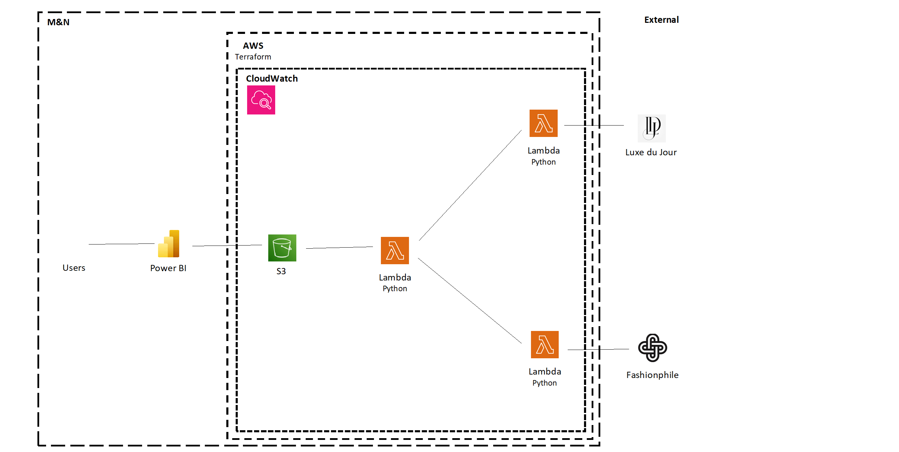
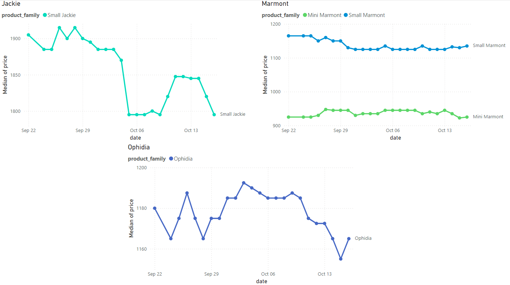

This project scrapes resale handbag prices and dumps them to a flat file in an S3 bucket. The data in this bucket is to accessed by Power BI to create visualizations that support business logic. The broad application has the following architecture:\

# Setup
## Set access key for TF:
export AWS_ACCESS_KEY_ID={AWS access key ID goes here}\
export AWS_SECRET_ACCESS_KEY={AWS secret access key goes here}

## Deploy:
terraform init\
terraform plan\
terraform apply

## To Destroy:
terraform destroy

# Power BI	
The Power BI report is attached as a .pbix file. The following is a screenshot of a page of the report, showing how scraped data retrieved from the S3 bucket can be shown as a time series of prices, to help support business logic and decision making:\
